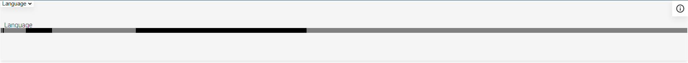

# Composants Web Visualisation de données pour TEI-Publisher

## Introduction
Le dépôt est un prof of concept de composant web dédié à la visualisation de données dans TEI-Publisher. Le prof of concept repose sur deux principes simples : la réutilisabilité du projet par les créateurs de plateforme Tei-publisher et de permettre aux visiteurs une meilleure intelligibilité de la donnée.
## Table des matières
 * [Installation](#Installation)
 * [listes de balises](#Liste_de_balises)
    - [pb-gui-frame](#pb-gui-frame)
    - [pb-gui-bar-chart](#pb-gui-bar-chart)
      
## Installation

Téléverser le fichier dans le dossier ressources/scripts de votre application TEI Publisher

Insérer le code suivant dans le fichier Index.html

```
    <script type="module" src="resources/scripts/dataviz/pb-gui-bundle.js"/>
    <link rel="stylesheet" href="resources/scripts/dataviz/pb-gui-style.css"/>
```

## Liste de balises


### pb-gui-frame

Il s'agit de la balise qui transmet les informations aux balises enfants

**Les attributs :**
- **selected :**  Définit le graphique a afficher par défault

**Les évenement :**
- **data :** Génére un évemenement dés que les données sont chargé

**Exemple:**
```
    <pb-gui-frame selected="Language">
        <pb-gui-bar-chart title="Language" config="dev2/resources/scripts/dataviz/config/Config1.json"/>
        <pb-gui-bar-chart title="Typologie" config="dev2/resources/scripts/dataviz/config/Config2.json"/>
    </pb-gui-frame>   
```

### pb-gui-bar-chart




**Les variables Css :**
- **--pb-gui-background** 
- **--pb-gui-stroke-primary** 
- **--pb-gui-stroke-secondary** 
- **--pb-gui-stroke-hover** 

**Les attributs :**
- **title \* :** Défénit le titre du graphique
* **info :** Défénit le carré d'information
- **config \* :**  Défénit le chemin vers le JSON de configuration
    - Label \* : le titre de la bar
    - xpath \* : la rêquete xpath a évectuer dans les fichiers
    - Facet : la facet liée à la bar
    - Exemple :     
        ```
        [
            { 
            "Label": "Language", 
            "xpath": "//tei:langUsage/tei:language/@ident", 
            "Facet": "facet-language"
            }
        ]
        ```